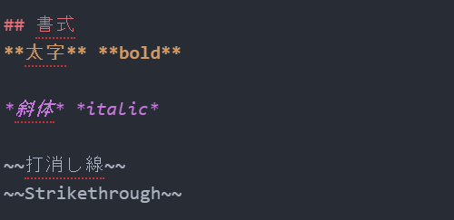

# portfolio
ポートフォリオページ

atomで追加

# 見出し１

## 見出し２

### 見出し３


## 書式
**太字** **bold**

*斜体* *italic*

~~打消し線~~
~~Strikethrough~~

## コードブロック
これは`code block
within a line`です。

```cs
string a="これはC#(cs)初期のブロック";
```

## リンク

[unityroom 吉田光希](https://unityroom.com/users/t8vnzrsw0ud432kaebqx)

## 画像




## 箇条書き

###通常リスト

- 箇条書き
- 箇条書き２
- 箇条書き３

### 途中から番号を始める

100. 好きな値から
100. 始められる
